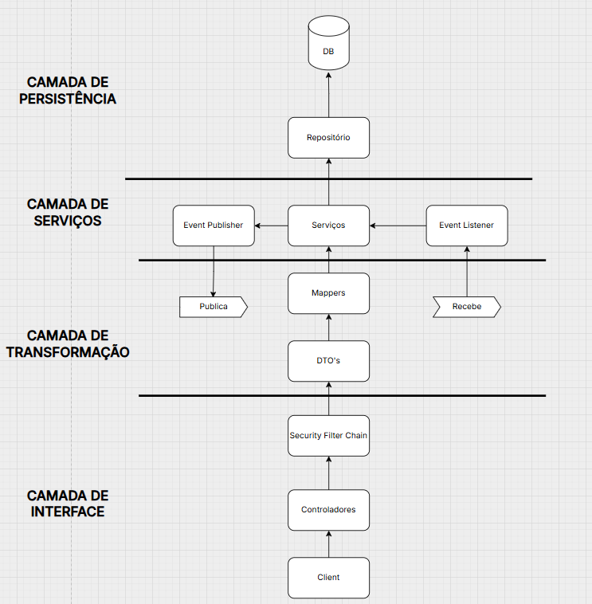
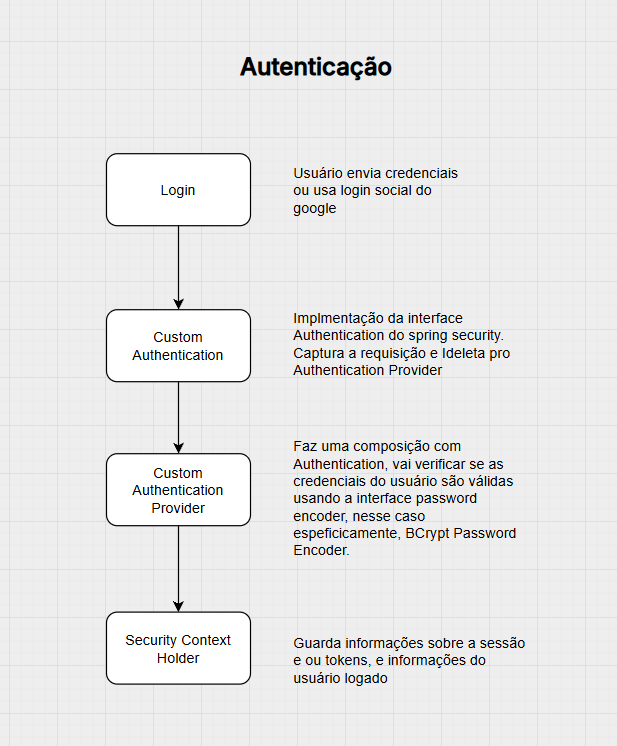

# 📽️ Aplicativo de Vídeos

Bem-vindo ao **Aplicativo de Vídeos**! 🎬📲 Uma plataforma onde usuários podem assistir vídeos, interagir por meio de comentários e organizar seus conteúdos favoritos. Desenvolvido com **Spring Boot**, segurança integrada e uma API bem estruturada.

---

## 🚀 Funcionalidades Principais

- 🔹 **Gerenciamento de Vídeos**: Upload, listagem e exclusão de vídeos.
- 💬 **Comentários em Vídeos**: Usuários podem comentar e interagir.
- 👤 **Sistema de Usuários**: Cadastro, autenticação e gestão de favoritos.
- 🔒 **Segurança com Spring Security**: Autenticação e autorização baseadas em funções.
- ⭐ **Favoritar Vídeos**: Salve seus vídeos favoritos para fácil acesso.

---

## 📂 Arquitetura do Projeto

Este projeto segue uma **arquitetura em camadas**, garantindo separação de responsabilidades:

## 📂 Estrutura de Pastas do Projeto

A organização do repositório segue uma estrutura clara para facilitar manutenção, escalabilidade e compreensão do fluxo do sistema:

```
📂 .../
 ├── 📂 controller/     # Controladores REST responsáveis por expor os endpoints
 ├── 📂 service/        # Serviços com as regras de negócio e lógica da aplicação
 ├── 📂 repository/     # Interfaces para comunicação com o banco de dados
 ├── 📂 dto/            # Objetos de transferência de dados (DTOs)
 ├── 📂 security/       # Configurações e classes relacionadas à segurança
```

Essa estrutura modular permite que cada camada seja desenvolvida e testada de forma independente, promovendo a clareza e organização do código.

### 🔍 Diagrama da Arquitetura

Abaixo está um esquema simplificado da arquitetura em camadas do sistema:




---

## 🔐 Segurança e Autenticação

A segurança é gerenciada com **Spring Security**, utilizando autenticação JWT.



**Perfis de usuários:**
- 🛡️ **Admin**: Acesso total ao sistema.
- 👤 **Usuário comum**: Pode assistir, comentar e favoritar vídeos.

### 🔒 Code sample - Configuração de Segurança

```java
public class SecurityConfiguration {

    private final LoginSocialSuccessHandler socialHandler;
    @Bean
    public SecurityFilterChain securityFilterChain(HttpSecurity http) throws Exception {
        return http
        .csrf(AbstractHttpConfigurer::disable)
        .httpBasic(Customizer.withDefaults())
        .formLogin(configurer ->{
            configurer.loginPage("/login");
        })
        .authorizeHttpRequests(authorizer -> {
            authorizer.requestMatchers("/login").permitAll();
            authorizer.requestMatchers(HttpMethod.POST, "api/usuario/**").permitAll();
            authorizer.anyRequest().authenticated();


        })s
        .oauth2Login(oauth2 -> {
            oauth2
            .loginPage("/login")
            .successHandler(socialHandler);
        })
        .build();
    }
}...
```

---

## 🎯 Exemplos de Uso da API

### 🔹 Criar um novo usuário
```http
POST /api/usuarios
```
```json
{
  "nome": "João Silva",
  "email": "joao@email.com",
  "senha": "123456"
}
```

### 🔹 Listar vídeos
```http
GET /api/videos
```

### 🔹 Favoritar um vídeo
```http
POST /api/usuarios/{id}/favoritar/{videoId}
```

### 🔹 Adicionar um comentário
```http
POST /api/videos/{videoId}/comentarios
```
```json
{
  "usuarioId": 1,
  "texto": "Ótimo vídeo! Muito informativo."
}
```

---

## 💻 Tecnologias Utilizadas

- **Java**
- **Spring Boot**
- **Spring Security + JWT**
- **Hibernate + JPA**
- **MySQL**
- **Swagger para documentação da API**

---

## 📜 Como Rodar o Projeto

1️⃣ **Clone o repositório**:
```sh
git clone https://github.com/MigueldsBatista/streaming_app.git
cd rea4e
```

2️⃣ **Configure o banco de dados** (MySQL no `application.properties`):
```properties
spring.datasource.url=jdbc:postgresql://localhost:3306/seu_banco
spring.datasource.username=seu_usuario
spring.datasource.password=sua_senha
```

3️⃣ **Compile e rode a aplicação**:
```sh
mvn spring-boot:run
```

4️⃣ **Acesse a API no navegador**:
```
http://localhost:8080/swagger-ui.html
```

---

## 📌 Contribuição

Quer contribuir? Sinta-se à vontade para abrir issues ou enviar pull requests! 🚀

---


