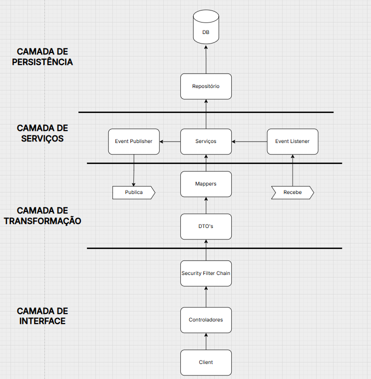
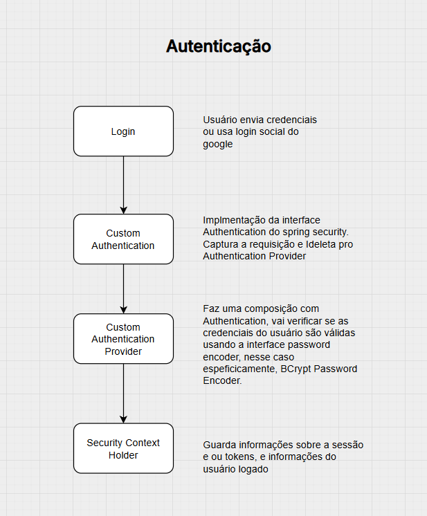

# 📽️ Video Application

Welcome to the **Video Application**! 🎬📲 A platform where users can watch videos, interact through comments, and organize their favorite content. Developed with **Spring Boot**, integrated security, and a well-structured API.

---

## 🚀 Main Features

- 🔹 **Video Management**: Upload, listing, and deletion of videos.
- 💬 **Video Comments**: Users can comment and interact.
- 👤 **User System**: Registration, authentication, and favorites management.
- 🔒 **Security with Spring Security**: Role-based authentication and authorization.
- ⭐ **Favorite Videos**: Save your favorite videos for easy access.

---

## 📂 Project Architecture

This project follows a **layered architecture**, ensuring separation of concerns:

## 📂 Project Folder Structure

The repository organization follows a clear structure to facilitate maintenance, scalability, and understanding of the system flow:

```
📂 .../
 ├── 📂 controller/     # REST Controllers responsible for exposing endpoints
 ├── 📂 service/        # Services with business rules and application logic
 ├── 📂 repository/     # Interfaces for database communication
 ├── 📂 dto/            # Data Transfer Objects (DTOs)
 ├── 📂 security/       # Security-related configurations and classes
```

This modular structure allows each layer to be developed and tested independently, promoting code clarity and organization.

### 🔍 Architecture Diagram

Below is a simplified schematic of the system's layered architecture:




---

## 🔐 Security and Authentication

Security is managed with **Spring Security**, using JWT authentication.



**User Profiles:**
- 🛡️ **Admin**: Full system access.
- 👤 **Standard User**: Can watch, comment on, and favorite videos.

### 🔒 Code sample - Security Configuration

```java
public class SecurityConfiguration {

    private final LoginSocialSuccessHandler socialHandler;
    @Bean
    public SecurityFilterChain securityFilterChain(HttpSecurity http) throws Exception {
        return http
        .csrf(AbstractHttpConfigurer::disable)
        .httpBasic(Customizer.withDefaults())
        .formLogin(configurer ->{
            configurer.loginPage("/login");
        })
        .authorizeHttpRequests(authorizer -> {
            authorizer.requestMatchers("/login").permitAll();
            authorizer.requestMatchers(HttpMethod.POST, "api/usuario/**").permitAll();
            authorizer.anyRequest().authenticated();


        })s
        .oauth2Login(oauth2 -> {
            oauth2
            .loginPage("/login")
            .successHandler(socialHandler);
        })
        .build();
    }
}...
```

---

## 🎯 API Usage Examples

### 🔹 Create a new user
```http
POST /api/usuarios
```
```json
{
  "nome": "John Doe",
  "email": "john@email.com",
  "senha": "123456"
}
```

### 🔹 List videos
```http
GET /api/videos
```

### 🔹 Favorite a video
```http
POST /api/usuarios/{id}/favoritar/{videoId}
```

### 🔹 Add a comment
```http
POST /api/videos/{videoId}/comentarios
```
```json
{
  "usuarioId": 1,
  "texto": "Great video! Very informative."
}
```

---

## 💻 Technologies Used

- **Java**
- **Spring Boot**
- **Spring Security + JWT**
- **Hibernate + JPA**
- **MySQL**
- **Swagger for API documentation**

---

## 📜 How to Run the Project

1️⃣ **Clone the repository**:
```sh
git clone https://github.com/MigueldsBatista/streaming_app.git
cd rea4e
```

2️⃣ **Configure the database** (MySQL in `application.properties`):
```properties
spring.datasource.url=jdbc:postgresql://localhost:3306/your_database
spring.datasource.username=your_user
spring.datasource.password=your_password
```

3️⃣ **Build and run the application**:
```sh
mvn spring-boot:run
```

4️⃣ **Access the API in your browser**:
```
http://localhost:8080/swagger-ui.html
```

---

## 📌 Contribution

Want to contribute? Feel free to open issues or submit pull requests! 🚀

---
